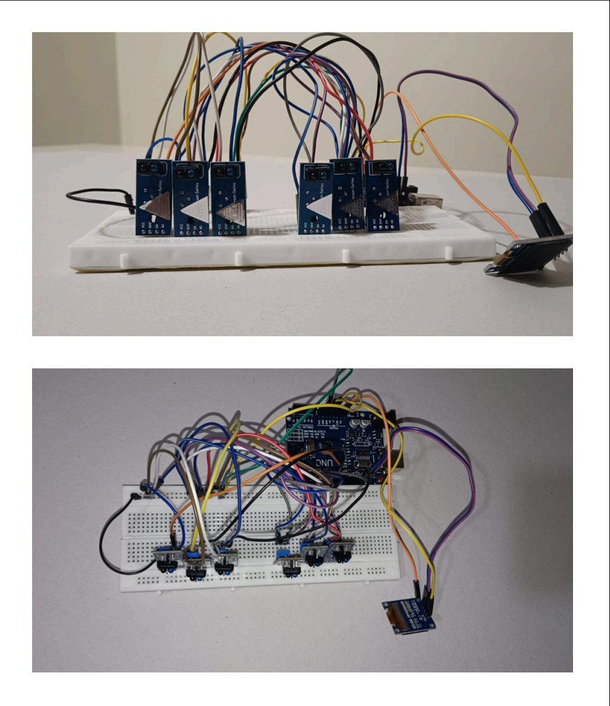

# 🅿️ Parking Lot Monitoring System  
### Using Arduino Uno, TCRT5000 IR Sensors & 0.96" OLED Display  
---
## 🔌 Circuit

---

## 📌 Overview  
This project is a prototype **smart parking lot system** that detects vehicle presence using **TCRT5000 infrared sensors** and displays the number of **vacant and occupied parking spaces** on a **0.96" OLED display**.

The system uses:  
- **6 × TCRT5000 IR sensors**  
- **Arduino Uno R3**  
- **0.96" OLED Display (I2C)**  
- **Jumper wires**

The Arduino reads signals from the sensors, processes the data, and updates the OLED display in real time.

---
---

## 💰 Budget  
**Estimated Cost:** ₹900 – ₹1000  

---

## 🧩 Components Used  

| Component | Quantity |
|----------|----------|
| Arduino Uno R3 | 1 |
| TCRT5000 IR Sensors | 6 |
| OLED Display 0.96" (I2C) | 1 |
| Jumper Wires (M-M, F-F, M-F) | As required |

---

## 🛠️ Working Principle  

### **🔹 TCRT5000 Infrared Sensor**
- Emits infrared light and detects reflections from nearby objects (cars).  
- **HIGH output** → No object  
- **LOW output** → Object detected (car present)

---

### **🔹 Arduino Uno R3**
- Reads sensor outputs from digital pins.  
- Determines which spots are **free** or **occupied**.  
- Sends data to OLED display through **I2C communication**.

---

### **🔹 OLED Display (0.96" I2C)**
Displays real-time values:
- **Occupied spots**  
- **Vacant spots**

---

## 🎯 Objectives  
- Display number of vacant parking spots.  
- Demonstrate use of IR-based detection in real-time systems.  
- Provide clear and fast visual feedback using an OLED display.

---

## 🧪 Result  
- Vehicle entry and exit are detected accurately.  
- OLED display updates **instantly** with updated parking status.  

---

## 🧿 Future Enhancements  
- Develop a mobile app for live parking updates.  
- Add heatmap visualization for parking load.  
- Implement servo-controlled automated entry/exit gates.

---
